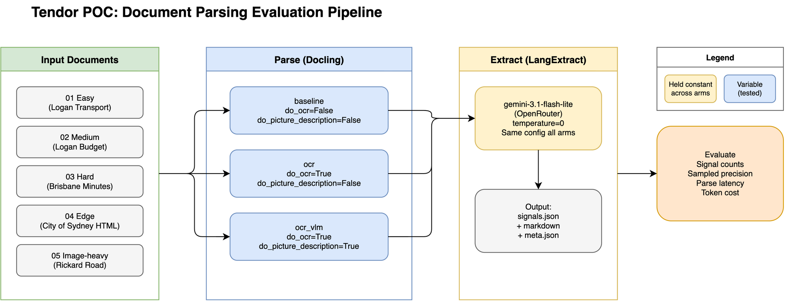

# Tendor POC: Document Parsing Comparison

Does a better document-parsing layer measurably improve procurement signal extraction?

## Pipeline Overview



## Setup

Requires Python 3.12+ and [uv](https://docs.astral.sh/uv/).

```bash
uv sync
```

## Run

```bash
# Full pipeline (parse + extract, all arms)
uv run python run_pipeline.py

# Or individual steps:
uv run python src/parse.py
uv run python src/extract.py
uv run python src/evaluate.py

# Pipeline options:
uv run python run_pipeline.py --arms baseline ocr    # specific arms only
uv run python run_pipeline.py --skip-parse            # extract only
uv run python run_pipeline.py --skip-extract          # parse only
```

## Project structure

- `documents/` - source PDFs and HTML
- `golden/` - manually annotated golden samples
- `results/` - parser output and extraction results (gitignored)
- `src/parse.py` - baseline, ocr, and ocr_vlm arms via Docling
- `src/extract.py` - LangExtract signal extraction (same config all arms)
- `src/evaluate.py` - compare arms against golden sample
- `docs/adr/` - decision records

## Evaluation design

See [ADR 0001](docs/adr/0001-evaluation-design.md).